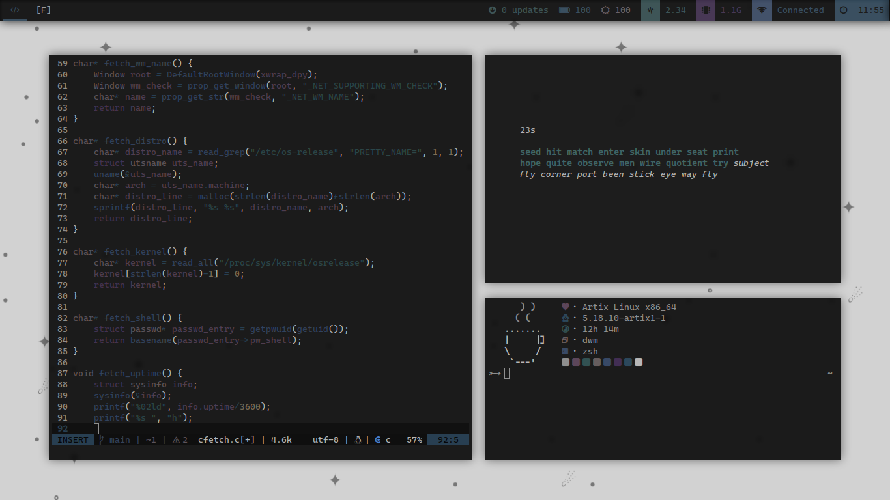

<h1 align="center">
    <br>
    
    <br>
    gabrielzschmitz dotfiles
    <br>
</h1>

<h4 align="center">A rice focused in speed, produtivity and to suck less.</h4>
<p align="center">
<a href="./LICENSE"></a>
<a href="https://www.buymeacoffee.com/gabrielzschmitz" target="_blank"></a>
<a href="https://github.com/gabrielzschmitz/dotfiles"></a>
</p>

## 💾 How to Install
<b>Note</b>: change<i> $REPOPATH</i> to wherever you'd like to clone the bare repository and<i> $REPOALIAS</i> to whatever you want the alias to the repo be.

Just follow this <b>steps</b>:
```shell
$ REPOPATH="$HOME/doc/dotfiles"
$ REPOALIAS="dots"
$ echo "alias $REPOALIAS='/usr/bin/git --git-dir=$REPOPATH --work-tree=$HOME'" >> $HOME/.zshrc
$ source ~/.zshrc
$ git clone --bare https://www.github.com/gabrielzschmitz/dotfiles.git $REPOPATH
```

<b>Note</b>: if checkout is impossible try to <i>'rm'</i> and <i>'rm -rf'</i> all the files/folders that are appearing as a conflict.
```shell
$ $REPOALIAS checkout
$ $REPOALIAS config --local status.showUntrackedFiles no
```

## 🎨 Riced programs
The following software were <b>riced</b>:
<i>
 * [dwm](https://github.com/gabrielzschmitz/dotfiles/tree/main/.local/src/zerodwm)
 * [dmenu](https://github.com/gabrielzschmitz/dotfiles/tree/main/.local/src/zerodmenu)
 * [st](https://github.com/gabrielzschmitz/dotfiles/tree/main/.local/src/zerost)
 * [herbe](https://github.com/gabrielzschmitz/dotfiles/tree/main/.local/src/zeroherbe)
 * [slock](https://github.com/gabrielzschmitz/dotfiles/tree/main/.local/src/zeroslock)
 * [sfm](https://github.com/gabrielzschmitz/dotfiles/tree/main/.local/src/zerosfm)
 * [xmenu](https://github.com/gabrielzschmitz/dotfiles/tree/main/.local/src/zeroxmenu)
 * [nvim](https://github.com/gabrielzschmitz/dotfiles/tree/main/.config/nvim)
 * [ncmpcpp](https://github.com/gabrielzschmitz/dotfiles/tree/main/.config/ncmpcpp)
 * [zsh](https://github.com/gabrielzschmitz/dotfiles/tree/main/.config/zsh)
 * [picom](https://github.com/gabrielzschmitz/dotfiles/blob/main/.config/picom.conf)
</i>

## 📜 License
This project is licensed under the [GPL-3](./LICENSE) license.

